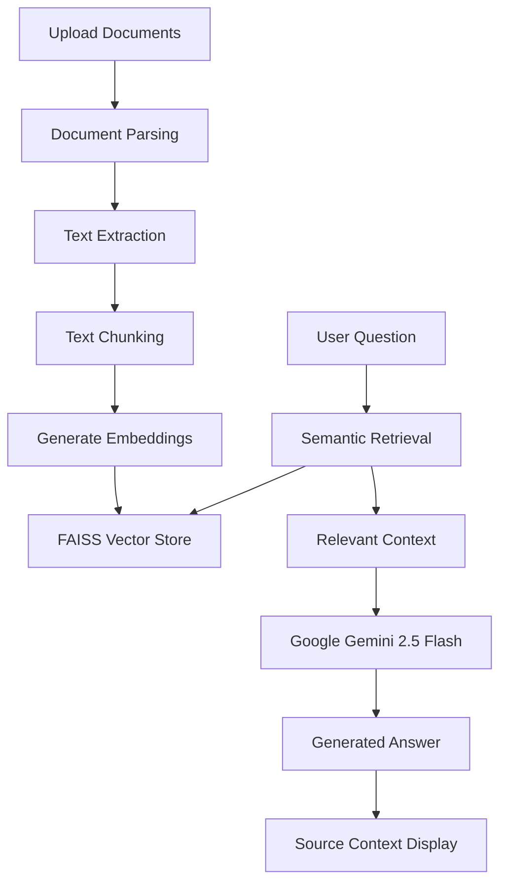

# 🤖 ChatDocAI – AI Document Assistant (RAG | Gemini | LangChain) 
<p align="center"> 
  
<a href="https://chatdocc.streamlit.app/"> 
  
</a> 

<a href="https://github.com/tfregixx/ChatDocAI-RAG-based-AI-Document-Assistant-"> 
  
</a> 

</p> 

<p align="center"> 
  
 
  
 
  
 
  
 
  

  
 
  
 
  

  
 
  
 
  

  
</p> 
  
<p align="center"> 
 
    
 
    
 
    
 
    
</p> 
<p align="center"> 
🚀 Upload Documents → Ask Questions → Generate Quizzes → Get AI-Powered Answers 
</p> 
    
  --- 
    
## 📖 Overview 
ChatDocAI is a **GenAI-powered Document Assistant** built using **Retrieval-Augmented Generation (RAG)** that allows users to upload PDF and TXT documents and interact with them using natural language. 

The application combines **Google Gemini 2.5 Flash**, **LangChain**, **FAISS Vector Search**, and **Sentence Transformer Embeddings** to provide accurate, context-aware answers grounded in uploaded documents. 

---

## 🎯 Problem 
Users often struggle to locate important information inside large documents. 

Traditional keyword-based search cannot understand semantic meaning and frequently misses relevant information hidden within lengthy content. 

---

## 💡 Solution 
ChatDocAI implements a complete **Retrieval-Augmented Generation (RAG)** pipeline that: 
* Extracts text from uploaded documents 
* Generates semantic embeddings 
* Stores vectors in FAISS 
* Retrieves relevant context through similarity search 
* Generates grounded responses using Gemini 
This enables intelligent document interaction with significantly higher accuracy than traditional search methods. 

--- 

## 🚀 Impact 
* Improved answer relevance compared to keyword search 
* Reduced hallucinations using source-grounded retrieval 
* Faster information discovery from large documents 
* Enhanced learning through AI-generated quizzes 
* Multilingual document interaction 

--- 

## ✨ Features 
### 📂 Smart Document Processing 
* Upload PDF documents 
* Upload TXT files 
* Multi-document support 
* Automatic content extraction 

### 💬 AI-Powered Chat 
* ChatGPT-style conversation interface 
* Context-aware responses 
* Grounded document answers 
* Real-time interaction

### 🧠 Retrieval-Augmented Generation (RAG) 
* Semantic similarity search 
* Embedding-based retrieval 
* Top-K contextual search 
* FAISS vector indexing 

### 🌐 Multilingual Support 
* English 
* Tamil 
* Hindi 
* Spanish 
* French 

### 🎯 AI Quiz Generator 
* Generate MCQs from uploaded documents 
* Learning-focused assessments 
* Instant knowledge testing 
    
### 📄 Source Transparency 
* Displays retrieved context 
* Improves explainability 
* Supports answer verification 

--- 
    
## 🌐 Live Demo 

### 🚀 Streamlit Application 

[https://chatdocc.streamlit.app/](https://share.streamlit.io/user/tfregixx)
    
### 💻 GitHub Repository 

https://github.com/tfregixx/ChatDocAI-RAG-based-AI-Document-Assistant-

---

## 🛠️ Technologies Used 

### Frontend 
* Streamlit 
* HTML 
* CSS 

### Backend & AI 
* LangChain 
* Google Gemini 2.5 Flash 
* Sentence Transformers 

### Vector Database 
* FAISS

### Document Processing 
* PyPDF 
* TextLoader 

### Programming Language 
* Python 

### Version Control
* Git 
* GitHub

---

## 🧠 Architecture



---

## 🎥 Demo


[▶️ Watch Demo](https://github.com/tfregixx/ChatDocAI-RAG-based-AI-Document-Assistant-/blob/main/demo.webm)

 ### 🌐 Live Application 
[ https://chatdocc.streamlit.app/ ](https://share.streamlit.io/user/tfregixx)

✨ Upload documents → Ask questions → Get AI-powered answers  

---

## 🖼️ Screenshots

### 📂 Upload Documents
> Upload PDFs and start querying instantly  


---

### 💬 Chat Interface
> Ask questions and get AI-powered answers  


---

### 🤖 AI Generated Response
> Context-aware answers with document grounding  


---

## Installation

1. Clone the repository:
```bash
git clone https://github.com/tfregixx/ChatDOC-AI.git
cd ChatDOC-AI
```

2. Install dependencies:
```bash
pip install -r requirements.txt
```
3. Configure Gemini API Key Create:
toml
.streamlit/secrets.toml

Add:
toml
GOOGLE_API_KEY="YOUR_GEMINI_API_KEY"

4. Run the application:
```bash
streamlit run app.py
```
5. Open in browser:

http://localhost:8501

---

## 📦 Requirements

*txt
*streamlit
*langchain
*langchain-community
*langchain-google-genai
*faiss-cpu
*sentence-transformers
*pypdf
*scikit-learn

---

## 📊 Key Insights

- **✅ RAG enables context-aware document understanding**
- **✅ Semantic search improves retrieval accuracy**
- **✅ Gemini generates grounded responses**
- **✅ FAISS enables efficient vector retrieval**
- **✅ Source context improves explainability**
- **✅ AI-generated quizzes support learning**

---

## 🏗️ System Workflow

*📄 Document ingestion 
*✂️ Text chunking 
*🧠 Embedding generation 
*📊 FAISS indexing 
*🔍 Semantic retrieval 
*🤖 Gemini response generation 
*📄 Source evidence display

---

## 🧠 Advanced Capabilities

*✅ RAG pipeline from scratch  
*✅ Semantic Search  
*✅ Vector Similarity Retrieval 
*✅ Multi-Document Querying
*✅ AI Quiz Generation 
*✅ Multilingual Responses 
*✅ Source-Grounded Answers

---

## 📈 Results

*✅ Improved answer relevance compared to keyword search
*✅ Reduced hallucinations using RAG
*✅ Faster retrieval from large documents
*✅ Better user experience for document exploration
*✅ Scalable architecture using FAISS

---

## 🔮 Future Work

*🔥 Conversational Memory 
*📊 Citation-Based Responses 
*🧠 Multi-Document Reasoning 
*📄 Automated Summarization 
*🎤 Voice-Based Interaction 
*🤖 Agentic AI Workflows 
*📚 Knowledge Graph Integration

---

## 💡 Learnings 

*Built a complete RAG pipeline from scratch 
*Implemented semantic search using embeddings 
*Integrated Google Gemini APIs 
*Worked with FAISS vector databases 
*Developed production-ready AI applications 
*Designed scalable document intelligence systems 

---

## 📌 Author 
### Preethi Regina S D 

**AI Engineer | Generative AI | RAG Developer** 

🔗 LinkedIn: https://www.linkedin.com/in/regina2022/ 
💻 GitHub: https://github.com/tfregixx 

--- 

## ⭐ Support If you found this project useful: 

🌟 Star the repository 
🍴 Fork the project 
🚀 Share it with others 
💡 Contribute to future improvements 

--- 

<p align="center"> 
Made with ❤️ using Gemini, LangChain, FAISS & Streamlit 
</p>

