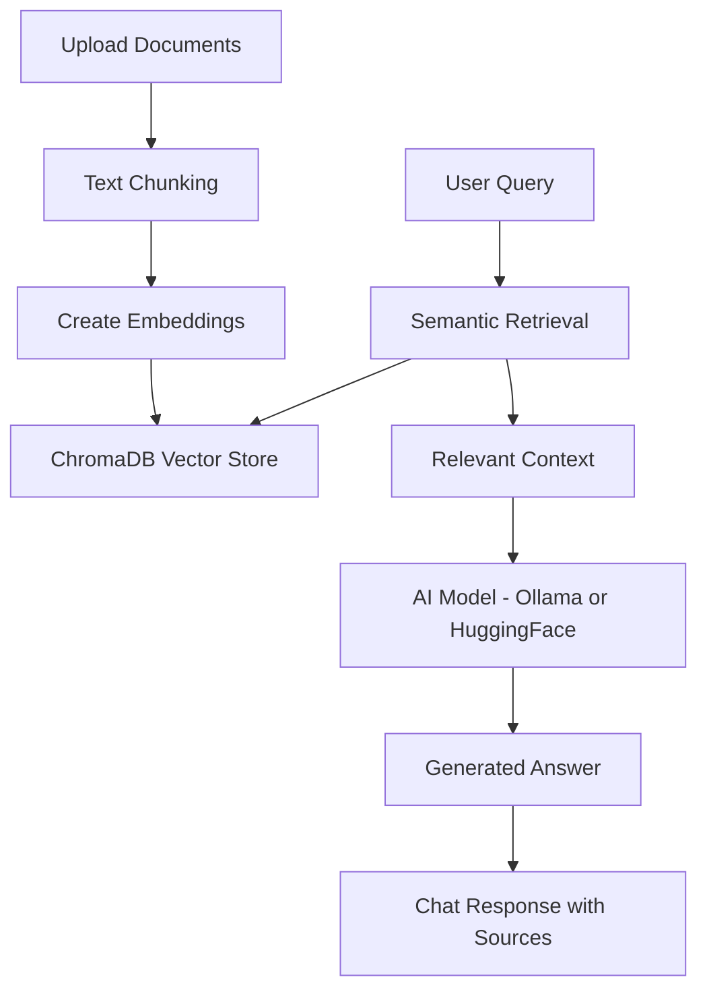
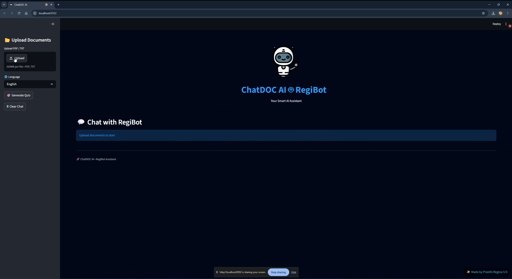
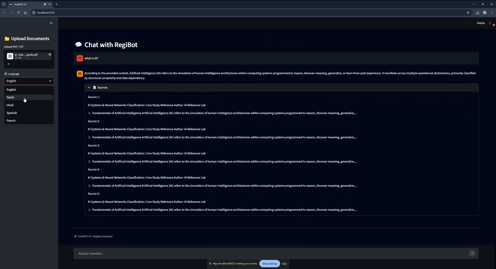
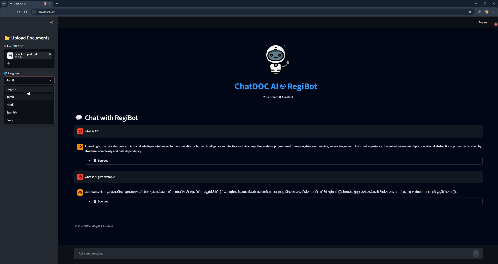

# 🤖 ChatDocAI – GenAI Document Assistant (RAG | LLM | LangChain)

<p align="center">
  
  
  
  
  
  
</p>

ChatDocAI is a **GenAI-powered document assistant built using RAG (Retrieval-Augmented Generation)** that allows users to query documents with **LLM-backed, context-aware answers**.
🚀 Built with RAG + LLMs to deliver accurate, context-aware answers from user documents.

---

## Problem
Users struggle to extract relevant information from large documents efficiently.

## Solution
ChatDocAI implements a **Retrieval-Augmented Generation (RAG)** pipeline that retrieves relevant document context using embeddings and generates accurate responses using LLMs.

## Impact
- Improved answer relevance compared to keyword-based search
- Enabled contextual, document-grounded responses
- Fully offline capability using local LLMs

---

## Features

- **📂 Document Upload:** Upload PDF and TXT documents  
- **💬 Chat Interface:** ChatGPT-style interaction  
- **🌐 Multi-Language:** English, Tamil, Hindi, Spanish, French  
- **🎯 Quiz Generator:** Create MCQs from documents  
- **🤖 RegiBot Assistant:** Animated AI with personality  
- **🔒 Offline Mode:** Works locally with Ollama  
- **🌐 Online Mode:** HuggingFace fallback  
- **📄 Source Evidence:** Transparent AI answers  
- **⚡ Fast Retrieval:** Vector search using embeddings  
- **🎬 UI Animations:** Typing and loading effects  

---

## Prerequisites

Ensure the following are installed:

- Python 3.9 or later  
- pip  
- Streamlit  
- Internet connection (for online mode)  
- Ollama (optional for offline AI)  

---

## Technologies Used

### Frontend
- Streamlit  
- HTML & CSS  

### Backend / AI
- LangChain  
- Ollama (LLaMA 3)  
- HuggingFace Models  
- Sentence Transformers  

### Database
- ChromaDB  

### Tools
- Python  
- Git & GitHub  

---

## 🧠 Architecture


---

## 🎥 Demo


[▶️ Watch Demo](https://github.com/tfregixx/ChatDocAI-RAG-based-AI-Document-Assistant-/blob/main/demo.webm)


✨ Upload documents → Ask questions → Get AI-powered answers  

---

## 🖼️ Screenshots

### 📂 Upload Documents
> Upload PDFs and start querying instantly  



---

### 💬 Chat Interface
> Ask questions and get AI-powered answers  



---

### 🤖 AI Generated Response
> Context-aware answers with document grounding  



---

## Installation

1. Clone the repository:
```bash
git clone https://github.com/tfregixx/ChatDOC-AI.git
cd ChatDOC-AI
```

2. Install dependencies:
```bash
pip install -r requirements.txt
```
3. Run the application:
```bash
streamlit run app.py
```
4. Open in browser:

http://localhost:8501

---

## 📊 Key Insights

- **✅ RAG enables context-aware document understanding**
- **✅ Semantic search improves retrieval accuracy**
- **✅ LLM responses are grounded using vector-based context**
- **✅ Local LLMs enable privacy-focused AI systems**

---

## 🏗️ System Workflow

- **📄 Document ingestion & chunking**
- **🧠 Embedding generation (HuggingFace)**
- **📊 Storage in ChromaDB (vector DB)**
- **🔍 Semantic retrieval (Top-K search)**
- **🤖 Response generation using LLM (Ollama)**

---

## 🧠 Advanced Capabilities

- ✅ RAG pipeline from scratch  
- ✅ Hybrid mode (online + offline LLMs)  
- ✅ Source-grounded responses  
- ✅ Semantic retrieval using embeddings  

---

## 📈 Results

- **✅ Improved answer relevance vs keyword search**
- **✅ Reduced hallucination using RAG**
- **✅ Efficient querying of large documents**

---

## 🔮 Future Work

- **🔥 Agentic workflows (multi-step reasoning)**
- **📊 Automated evaluation metrics**
- **🧠 Multi-document reasoning**
- **🎨 Improved UI and UX**

---

## 💡 Learnings

- **Built full RAG pipeline from scratch**
- **Worked with LLMs, embeddings, vector DB**
- **Designed real-world AI system architecture**

---

## 📌 Author

**Preethi Regina**  
AI Engineer | GenAI & RAG Developer  
[LinkedIn](https://www.linkedin.com/in/regina2022/)  

---

