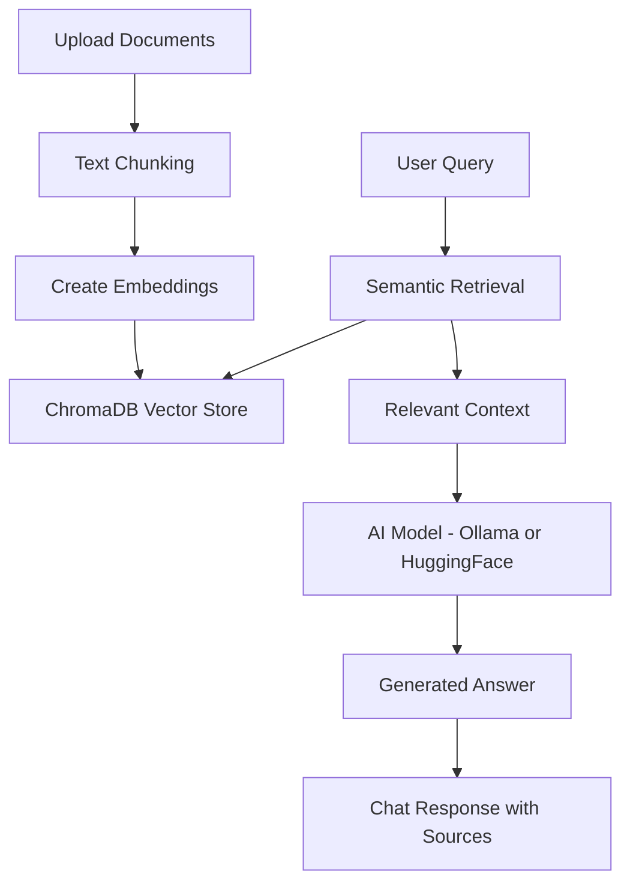

# 🤖 ChatDOC AI – RegiBot Smart Document Assistant

<p align="center">
  
  
  
  
  
  
</p>

ChatDOC AI is an intelligent document-based assistant that allows users to upload, search, and interact with their files using natural conversation.  
The system combines Retrieval-Augmented Generation (RAG) with modern AI technologies to provide accurate, context-aware answers, along with advanced features such as multilingual support, quiz generation, and an animated assistant called RegiBot.

---

## Features

- **📂 Document Upload:** Upload PDF and TXT documents  
- **💬 Chat Interface:** ChatGPT-style interaction  
- **🌐 Multi-Language:** English, Tamil, Hindi, Spanish, French  
- **🎯 Quiz Generator:** Create MCQs from documents  
- **🤖 RegiBot Assistant:** Animated AI with personality  
- **🔒 Offline Mode:** Works locally with Ollama  
- **🌐 Online Mode:** HuggingFace fallback  
- **📄 Source Evidence:** Transparent AI answers  
- **⚡ Fast Retrieval:** Vector search using embeddings  
- **🎬 UI Animations:** Typing and loading effects  

---

## Prerequisites

Ensure the following are installed:

- Python 3.9 or later  
- pip  
- Streamlit  
- Internet connection (for online mode)  
- Ollama (optional for offline AI)  

---

## Technologies Used

### Frontend
- Streamlit  
- HTML & CSS  

### Backend / AI
- LangChain  
- Ollama (LLaMA 3)  
- HuggingFace Models  
- Sentence Transformers  

### Database
- ChromaDB  

### Tools
- Python  
- Git & GitHub  

---

## 🧠 Architecture


---

## Installation

1. Clone the repository:
```bash
git clone https://github.com/tfregixx/ChatDOC-AI.git
cd ChatDOC-AI
```

2. Install dependencies:
```bash
pip install -r requirements.txt
```
3. Run the application:
```bash
streamlit run app.py
```
4. Open in browser:

http://localhost:8501

---

## How It Works

- User uploads documents
- Text is chunked
- Converted to embeddings
- Stored in ChromaDB
- User asks a query
- System retrieves relevant content
- AI generates response

---

## Example Use Cases

- Study assistant
- Document search engine
- Knowledge base chatbot
- Quiz generator

---

## Future Enhancements

- 🎤 Voice assistant (RegiBot speaking)
- 📄 PDF highlighting
- 💬 Chat history sidebar
- 🌐 Web deployment

---

## Contributing

Contributions are welcome!

- Fork the repository
- Create a branch
- Make changes
- Submit a pull request

---

## License (MIT)

MIT License
Copyright (c) 2026 Preethi Regina S D
Permission is hereby granted, free of charge, to any person obtaining a copy of this software and associated documentation files (the "Software"), to deal in the Software without restriction, including without limitation the rights to use, copy, modify, merge, publish, distribute, sublicense, and/or sell copies of the Software.
THE SOFTWARE IS PROVIDED "AS IS", WITHOUT WARRANTY OF ANY KIND.

---
## Author

Preethi Regina S D
